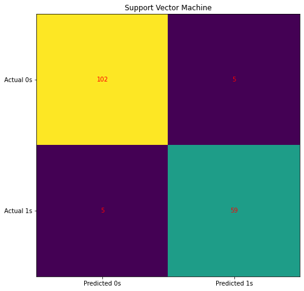

# The goal of this machine learning research is to determine if a tumor is malignant or benign. The data set comes from the University of Illinois at Chicago's machine learning database. 
1. The columns are as follows: ‘Sample Code Number’, ‘clump thickness’, ‘uniformity of cell size’, ‘uniformity of cell shape’, ‘marginal adhesion’, ‘single epithelial cell size’, ‘bare nuclei’, ‘bland chromatin’, ‘normal nucleoli’, ‘mitosis’ and ‘class’.
2. A comparison is made between 7 classification models, and decision tree classification model is found to be more succesful mode with accuracy of a confusion matrix :0.959.

Dataset Used: Breast Cancer Wisconsin (Diagnostic) Dataset


## Install Requirements

```bash
$ pip install -r requirement.txt
```





